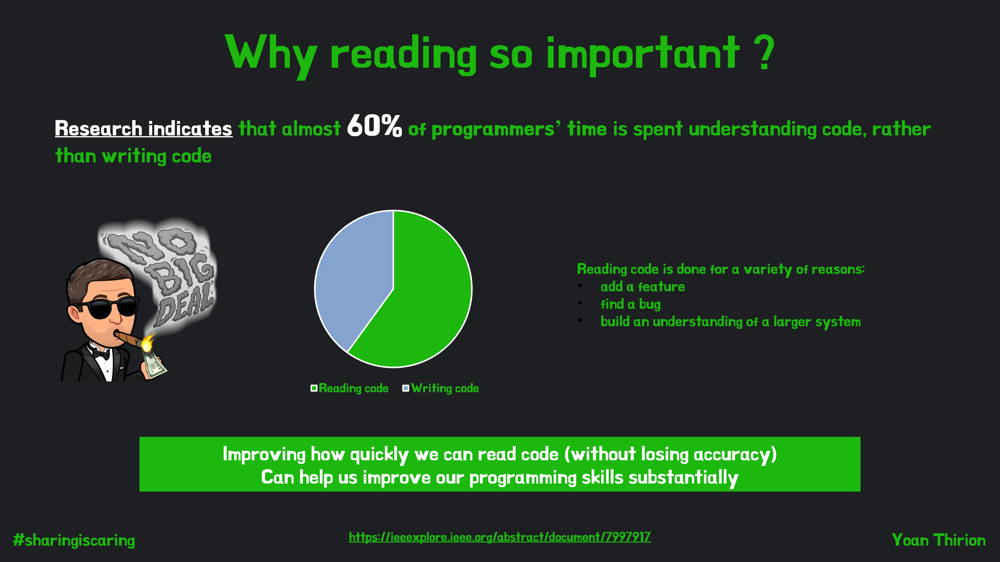
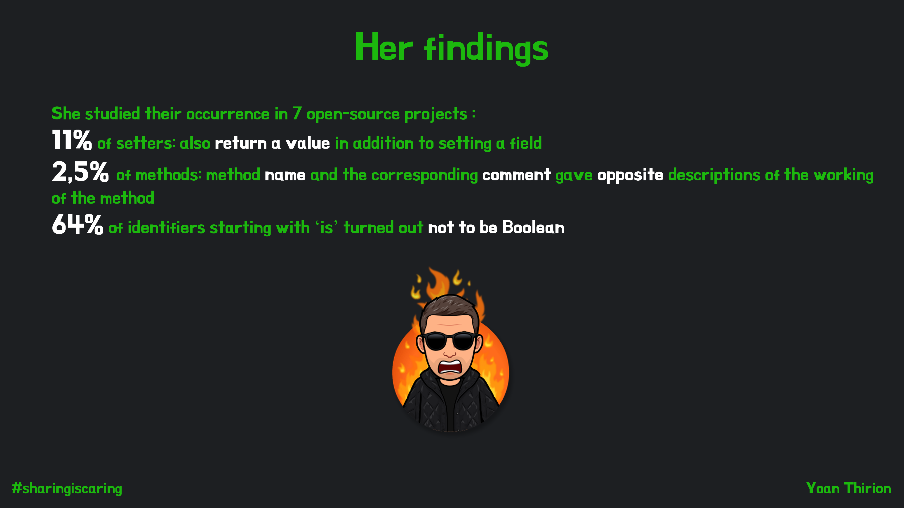

# Crappy Driven-Development (CDD)
Let's learn a new development practice : Crappy-Driven Development.
`The secret art of making yourself indispensable by writing crappy code !!!`

- [The kata](#kata)
  - [Mob roles](#mob-roles)
  - [Source of inspiration](#source-of-inspiration)
  - [Review](#review)
- [Clean Code principles](#clean-code-principles)
- [Programmer's Brain](#programmers-brain)
  - [Book infographic](#book-infographic)
  - [Workshop / slides](#workshop)
- [Reflect](#reflect)
- [Why this kata?](#why-this-kata-)
 

## Kata
In small groups / [mob](https://www.youtube.com/watch?v=SHOVVnRB4h0&ab_channel=GOTOConferences) :
* Choose a code in a language you want to work with (`C#`, `java`, `scala`, `js`)
* Your objective : Apply CDD to make the code so crappy that other groups won't be able to understand it
  * Follow the golden rules described below

  * Make it in Baby steps (crappy 1 thing at a time)
* You have 30 minutes to make as many cycles as possible :
  * Make it in mob
  * Be creative
  * The more brainfuck it is the better
  * Tests are green before and at the end of your refactoring

### Mob roles
I recommend to use [mobtime](https://mobti.me/) and configure below roles :
* Turn Duration : 5 minutes
* Create the 4 roles presented below

#### Driver

* Write the code according to the navigator's specification
* Listen intently to the navigators instructions
* Ask questions wherever there is a lack of clarity

#### Navigator

* Dictates the code that is to be written - the 'what'
* Clearly communicates what code to write
* Explains 'why' they have chosen the particular solution to this problem
* Check for syntax / type errors as the Driver drives

#### Scribe

* Write down the goals of each cycle in mobtime
* Explain why it has been decided

#### Crappier

* Anticipate what can be crappier
* Write down ideas that emerge in his/he mind and other ideas as well

### Source of inspiration
If you need some inspiration, here is a list of [ideas](docs/ideas.md). 

### Review
At the end of the 30 minutes period each mob presents the new version of their code.

## Clean Code principles
Map each crappy action with at least one of the `Clean Code` principle available [here](docs/clean-code.pdf)

## Programmer's Brain
If you want to understand the impact (on cognition) of not using `Clean Code` principles in your code you should definitely read [Programmer's Brain - What every programmer needs to know about cognition](https://www.manning.com/books/the-programmers-brain) by Felienne Hermans.

### Book infographic 
[Here](docs/programmers-brain.pdf) is my infographic from this great book.

### Workshop
If you want to go further, I have created a workshop in 2 parts based on the learnings from Felienne's book:
- [How to read code better](https://speakerdeck.com/thirion/the-programmers-brain-read-code-better)
- [Be better at code](https://speakerdeck.com/thirion/2-be-better-at-code)

## Reflect
Take a few minutes to reflect and ask questions :
* Based on your mob refactoring list, which patterns did you observe recently in your codebase ?
* What did you learn from this kata ?
* How this practice can be applied in your current context ? 😜

## Why this kata ?
* By having a reversed reflexion (How can I make my code the crappiest possible), people think outside of the box
* The list of implemented crappy refactoring serve as an anti-patterns list :
  * All the code smells they must avoid in their own code
  * Stuff to fight against
* Learn Mob Programming
* Practice automated refactoring : rename, move, extract, ...
* Because it's fun 😊

